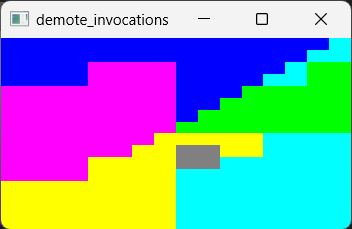

Vulkan Trivial Framework (VTF)
========
The main idea when writing this code was to get the fastest result with as little code as possible. The project was written in C++ language with the fetures available since the C++17 standard and my favorite one in C++, which is a templates. As you study the code, you will find some interesting solutions, I think. For example, the _VertexInput_ class tries to wrap everything up for creating an interface for shaders with automatic conversions from STL's vectors. In turn, the _PipelineManager_ class deals with the improvement of the creation of a wide range of descriptor sets, whereas _createGraphicsPipeline_ template function simplyfies creation of pipeline via recognizing subsequent states by type. Other methods or routines generalize to a greater or lesser extent the Vulkan API.  
I hope one will find the following sources useful not only for fun but also for getting to know Vulkan better.

Supported OSs and Requirements and Licensing
---------
This stuff strongly uses dynamically linked [Vulkan SDK](https://vulkan.lunarg.com/sdk/home) which has to be installed separately. Along with Vulkan SDK some of their binaries must be visble to the final VTF executable e.g. _glslangValidator_ or _spirvas_. Next to the VKSDK  the sources of this repo uses statically linked [GLFW](https://www.glfw.org/) library for a rendering - which also has to be installed separately.  
I wrote this code mainly with the idea that it would run under Linux OS, but Both of those installations are available for Linux and Windows operating systems so you can successfully run it under Windows as well if you like. Other systems, e.g. MacOS or Android are not currently supported, although who knows.  
Together with aforementioned ones some third-party libraries are used, these are: _stb_image.h_ from [STB repository](https://github.com/nothings/stb) and _stl_reader.h_ from [STL_READER repository](https://github.com/sreiter/stl_reader). Both of them are automatically cloned from their Github repositories during the building process by the _fetch_externals.py_ script. Of course you can be up to date with those repos by calling the script from scratch.
- [Vulkan SDK license](https://vulkan.lunarg.com/license/)
- [GLFW license](https://www.glfw.org/license)
- [STB license](https://github.com/nothings/stb/blob/master/LICENSE)
- [STL_READER license](https://github.com/sreiter/stl_reader/blob/master/LICENSE)

[Installation](help/installation.md) and [launching](help/launching.html)
------------------------

Shaders
-------
The shaders are built automatically at the first time when you are running particular test, although, there are the tests that force to build the shaders every time they are run. Shaders binaries are stored in the temprary system folder or in the location you can point as the parameter to the VTF executable. Basically the binaries are built every time their code changes. Then something kind of the checksum is calculated and if it does not match to the previous one then the shaders are rebuild.

Triangle test
-------------

In my opinion "Hello Triangle" must exist in every presentation regardless which technology it was written, so ...

Beside the test is really trivial you can run it on more than one thread, of course if your GPU supports multithreading.

Fractals test
-------------

This test will take you to a land where you can admire the beauty of the Mandelbrot's fractal. While holding down the mouse button,
find any place where you would like to dive and then, by scrolling, go deeper and deeper. The test automatically detects if your machine
supports Float64. If so, the journey will be even more interesting. Additionally you can run the test in animation mode then using a mice or a touchpad along with keyboard keys will cause the fractal will be zoomed in or out every millisecond you passed as a parameter.

Demote invocation test
----------------------

As you probably know, the fragment shader has absolutely different execution model from the other shaders. Additionally it has special invocations called helper invocations. More over, we can make the helper invocation from existing regular one by demoting it to the helper invocation. Since SPIR-V 1.3 we have a *demote*, new keyword in the GLSL language that exactly demotes invocation being processed. There are some implementations that don't support helper invocations at all but they also can demote any invocation. The single difference is that we cannot query about given invocation is helper or not and therefore whether it has been demoted - but it is small detail.  
This test allows you to demote/disable arbitral invocation or quad. Additionally you can see online which subgroup the invocation belongs to and what happened with it after clicking it by right mouse button. Finally, you can provide your own values by changing the shader and see them on the console output.

Panorma viewer test
-------------------

In turn, this test acts as a simple image viewer that can process several well-known formats, for example JPG, PNG, etc (thanks to stb_image). Additionally, the test allows to render panoramic photos that are passed with the `-p` parameter, then you can move
around inside the image. It turns out that the reading of the image from the storage is a serious bottle-neck, so don't
worry if you will see a splash while the image is loading. Pictures are loaded exactly once, next time if selected, they are
taken from a cache.

Internal compute test
---------------------

There is often a need to check whether a given piece of the compute shader code works or whether it compiles without errors. This test allows you to quickly verify the above as well as execute the shader and capture the results in the storage buffer. Using this you can dispatch the shader with arbitral local groups or work groups. Your shader will compile every time it has been changed and input to the shader you can give in many ways i.e. as sequence of floats or random integer list.

Internal graphics test
----------------------

Basically this test do the same things like _Internal compute test_ does with the small difference that it operates on graphics shaders which are vertex, tessellation control and evaluation, geometry and fragment shaders. You can use it with only vertex and fragment shaders pair or vertex, geometry and fragment. In the *assets* subdirectory there is a Python script that allows to run as many as you want the shaders that are organized in the pack of the shaders recognized by a name.

Internal thread pool test
-------------------------

This test has nothing to do with the Vulkan. It simply runs the self test which is a part of the _ThreadPool_ class. You can use this class and its functionality everywhere you want. Additionally you may notice a difference in the scheduler between the operating systems where this test is run.

# Enjoy!
