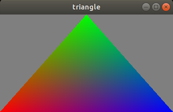
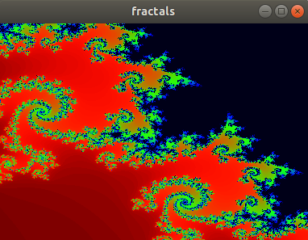

<h1>Vulkan Trivial Framework (VTF)</h1>

<h3>About:</h3>

Vulkan is excellent and awesome. Although it is terribly huge, I'm fascinated by it and I want to learn it every day, deeper and depper. I recognize there is a lot of similar 'frameworks' on the Internet but I wanted to have my own. This is actually VTF. The main idea when writing the code was to get the fastest result with as little code as possible. The project was written absolutely in C ++ in the C++17 standard with lots of language templates and features. As you study the code, you will find some interesting solutions, I think. For example, the VertexInput class tries to wrap everything up for creating an interface for shaders with automatic conversions from STL's vectors. In turn, the PipelineLayout class deals with the improvement of the creation of a wide range of descriptor sets and pipelines themselves. Other methods or routines generalize to a greater or lesser extent the Vulkan API. I hope one will find the following sources useful not only for fun but also for getting to know Vulkan better.
 
<h3>Prerequisites:</h3>
<ul>
  <li>Vulkan SDK</li>
  <li>CMake</li>
  <li>C++ compilers</li>
  <li>GLFW library</li>
</ul>

<h3>How to build:</h3>
<ul>
  <li>Download and install Vulkan SDK   - https://vulkan.lunarg.com/</li>
  <li>Download and CMake build system   - https://cmake.org/download/</li>
  <li>Install compilers. On Linux prefered g++ or clang++, on Windows Visual Studio 19</li>
  <li>Download and install GLFW library - https://www.glfw.org/download</li>
  <li>Download project from this site using: git clone https://github.com/michau-jakubek/vulkan.git</li>
  <li>Move to the root folder of the project</li>
  <li>Inside make a build folder (e.g. 'build') and go into</li>
   
  <li>In general to create a project or a solution type:
  <pre>
    cmake -G "???" -DCMAKE_BUILD_TYPE=??? -DVULKAN_INCLUDE_PATH=??? -DVULKAN_LIB_PATH=???
                                          -DGLFW3_INCLUDE_PATH=???  -DGLFW3_LIB_PATH=??? ..
  </pre>
  <ul>
    <li>-DCMAKE_BUILD_TYPE    Debug or Release</li>
    <li>-DVULKAN_INCLUDE_PATH must point to the Vulkan include path</li>
    <li>-DVULKAN_LIB_PATH     must point to the Vulkan link library</li>
    <li>-DGLFW3_INCLUDE_PATH  must point to the GLFW v3 include path</li>
    <li>-DGLFW3_LIB_PATH      must point to the GLFW v3 link library</li>
    <li>.. (do not forget)    must point to the folder with project CMakeLists.txt</li>
    <li>You can also specify -DCMAKE_CXX_COMPILER for your favorite one</li>
  </ul>
   
    Linux example:
    <pre>
    cmake -DCMAKE_BUILD_TYPE=DEBUG -DVULKAN_INCLUDE_PATH=/opt/vulkan/1.3.204.1/x86_64/include \
                                   -DVULKAN_LIB_PATH=/opt/vulkan/1.3.204.1/x86_64/lib/libvulkan.so \
                                   -DGLFW3_INCLUDE_PATH=/usr/include \
                                   -DGLFW3_LIB_PATH=/usr/lib/x86_64-linux-gnu/libglfw.so.3 ..
    </pre>
    Windows example:
    <pre>
    cmake -G "Visual Studio 16 2019" -DVULKAN_INCLUDE_PATH=c:\\VulkanSDK\\1.3.216.0\\Include ^
                                     -DVULKAN_LIB_PATH=c:\\VulkanSDK\\1.3.216.0\\Lib\\vulkan-1.lib ^
                                     -DGLFW3_INCLUDE_PATH=c:\\VulkanDeps\\glfw-3.3.8.bin.WIN64\\include ^
                                     -DGLFW3_LIB_PATH=c:\\VulkanDeps\\glfw-3.3.8.bin.WIN64\\lib-vc2019\\glfw3.lib ..
    </pre>
    </li>
</ul>
<h3>Build an executable:</h3>
    On Linux simply call <code>make -j23</code> command. Why 23? Because J23 is my favorite parameter, it is a cryptonym of intelligence agent Hans Kloss. You can omit multhreaded compilation at all.
     
    On Windows open an IDE then open a solution. You can find it in your build folder with 'my_project.sln' name. Build solution from menu. Results should be written under
    <code>build\app\Debug\app.exe</code> or <code>build\app\Release\app.exe</code>.
    
<h3>Program:</h3>

The program is compiled on fly with <code>glslc</code> compiler from Vulkan SDK when specific test is run first time or you made some changes in shaders code. Thus, <code>glslc</code> must be visible to the system where the test is running on. It creates suitable SPIR-V binaries in your temporary directory. Every time one change the shaders code the binaries will be recompiled once again with a new name, so there isn't a need to manage them manually.

<h3>How to run:</h3>
  The project consists of two static libraries: framework and tests linked together into the only one executable which is app.
  Next to the mentioned earlier there is another one folder 'assets' which holds all assets visible to the application, i.e. shaders.
  After app is invoked without any arguments you should see a list of available options:
<pre>
    Pass available option as a parameter:
    Usage: app [options] <test_name> [<test_param>,...]
    Options:
      -h, --help: prints this help
      -t: prints available test names
      -c: builds auto-complete command
      -dl: prints available device list
      -d <id>: picks device by id
      -l <layer> [-l <layer>]: enable layer(s)
      -ll: prints available instance layer names
      -bt: enable backtrace
      -vulkan <ver>:  (major * 10 + minor), default is 10 aka vulkan1.0
      -spirv <ver>:   (major * 10 + minor), default is 10 aka spirv1.0
      -spvvalid:      enable SPIR-V assembly validation
      -verbose:       enable application diagnostic messages
    Available tests are:
        fractals
        triangle
   </pre>
   <ul>
   <li>-ll option prints available layers on the system.</li>
   <li>-l  allows you to enable specific layer from available layers.</li>
   <li>-dl option allows you to verify what devices are visible to the Vulkan loader.</li>
   <li>-d  options selects a device specified by an index from available devices.</li>
   <li>Finally test_name is a name of the test from available test list to run.</li>
   </ul>
   Of course the list of available run options is much longer.
   Ultimately to run the fractals test the command would look like:
     <pre>    app -d 0 fractals</pre>
 
<h3>Triangle test</h3>
In my opinion "Hello Triangle" must exist in every presentation, thus... 
 
This test might be run with <code>-t num_threads</code>parameter as well, where it means a number of GPU threads you may want to
 employ. In the mean time you can see how small amount of source code is needed to draw the triangle.
<h3>Fractals test</h3>

This test will take you to a land where you can admire the beauty of the Mandelbrot's fractal. While holding down the mouse button, find any place where you would like to dive and then, by scrolling, go deeper and deeper. The test automatically detects if your machine supports Float64. If so, the journey will be even more interesting. Additionally I've add <code>-a msesc</code> execution parameter that allows to run animated fractal refreshed avery msecs period, then you can use mice buttons or control keys to manually manipulate of zoom.
If -a parameter is present an application shows some interesting information, e.g. pseudo frame rate.

<h3>Panorma viewer test</h3>

In turn, this test acts as a simple image viewer that can process several well-known formats, for example JPG. 
Additionally, the test allows you to view panoramic photos that are passed with the -p parameter, then you can move
around inside the image. It turns out that the reading of the image from the storage is a serious bottle-neck, so don't
worry if you will see a splash while the image is loading. Picture is loaded exactly once, next time if selected, it is
taken from a cache.

<h3>A few smaller tests that do not need description</h3>
<ul>
  <li><b>int_matrix</b> - test of internal matrices</li>
  <li><b>line_width</b> - verifies that lines has been drawn correctly (uses many renderpasses)</li>
  <li><b>toplogy</b> - allows interactively draw Vulkan's primitives depending on run parameters</li>
</ul>
<h3>Solutions you might be interested in</h3>
<ul>
  <li>main rendering loop callback</li>
  <li>VertexInput class that simplifies of building vertex input</li>
  <li>LayoutManager class that simplifies a work with descriptor sets</li>
  <li>template C++ function to create graphics pipeline</li>
  <li>template C++ function to manage barriers and barriers themself</li>
  <li>compile time conversion between C++ built-in types and VkFormat</li>
  <li>working with several renderpasses</li>
  <li>dynamic rendering</li>
</ul>
<h2>Enjoy!</h2>

